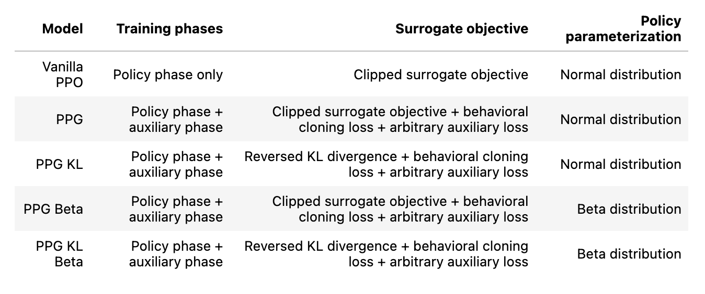

# PuckAI

This repo contains the code used for the final project report of **Reinforcement Learning lecture 2024/25** by Prof. Martius at University of Tübingen.

The goal is to develop a reinforcement learning (RL) agent capable of solving simple control tasks and competing in a simulated hockey game: https://github.com/martius-lab/hockey-env 

The core model is based on Proximal Policy Optimization (PPO) and extended with techniques such as Phasic Policy Gradient (PPG), KL divergence regularization, and Beta policy parameterization to address common PPO failure modes.

---

## Structure

You will find the models I build in the directory `.\src`, the experiments we conducted in `.\exp`, the data (like rewards, information, checkpoints run at cluster) in `.\dat`, and the report and figures in `.\doc`.

---

## Models

I compared five PPO models that get increasingly optimized:

  

---

## Experiments

In `.\exp\Documentation_RL_Project.ipynb` you can find a documentation of my experiments. `.\exp\comparison_models.py` is a script for comparing the five different PPO modifications, `.\exp\train.py` is a training loop for training the final model, `.\exp\hyperparam_search.py` is a script for hyperparameter tuning, and `.\exp\run_client.py` is a script used for the final tournament.

### Simple Environments

### Hockey Environment

---

## Literature

Cobbe, J. Hilton, O. Klimov, and J. Schulman. **Phasic policy gradient**, 2020
C.-Y. Hsu, C. Mendler-Dünner, and M. Hardt. **Revisiting design choices in proximal policy optimization**, 2020.
Schulman, F. Wolski, P. Dhariwal, A. Radford, and O. Klimov. **Proximal policy optimization algorithms**, 2017.
