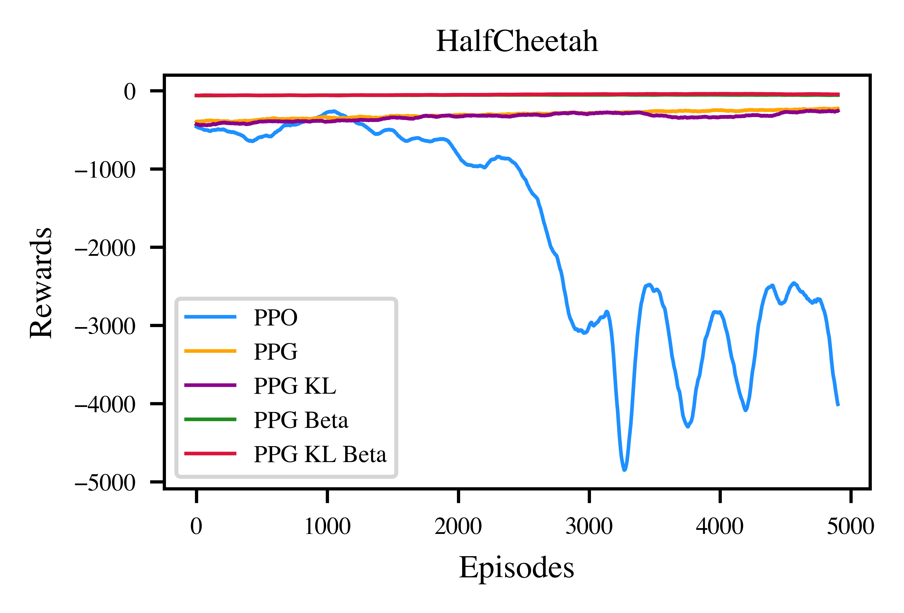
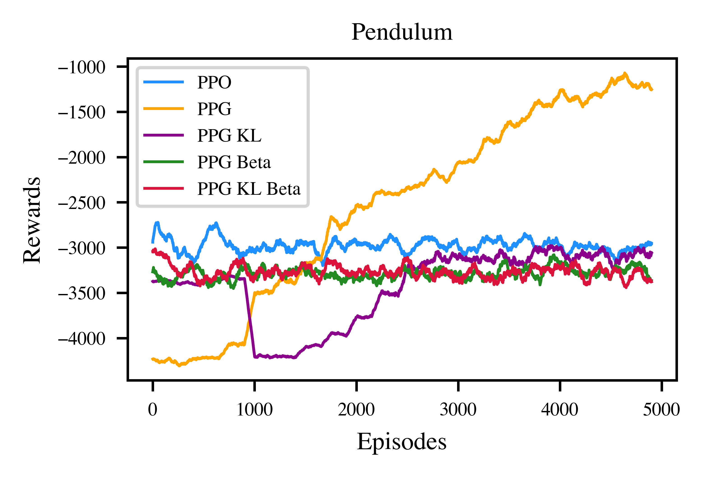
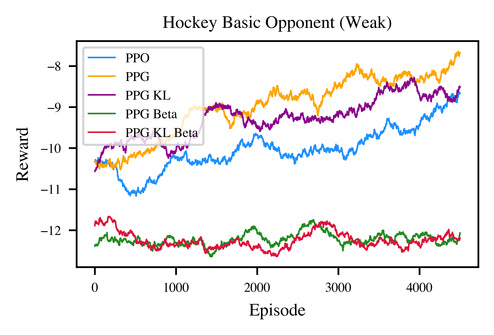
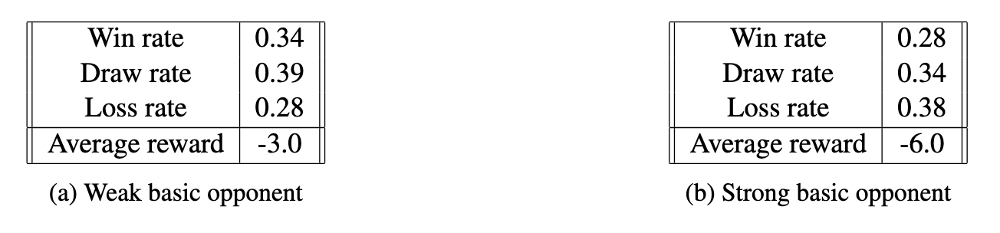

# PuckAI

This repo contains the code used for the final project report of **Reinforcement Learning lecture 2024/25** by Prof. Martius at University of Tübingen.

The goal is to develop a reinforcement learning (RL) agent capable of solving simple control tasks and competing in a simulated hockey game: https://github.com/martius-lab/hockey-env 

The base model is based on Proximal Policy Optimization (PPO) and extended with techniques such as Phasic Policy Gradient (PPG), KL divergence regularization, and Beta policy parameterization to address common PPO failure modes.

  

---

## Structure

You will find the models I build in the directory `.\src`, the experiments I conducted in `.\exp`, the data (like rewards, information, checkpoints ran at the cluster) in `.\dat`, and the report and figures in `.\doc`.

---

## Models

I compared five PPO models that get increasingly optimized:

  

---

## Experiments

All experiments can be found in `.\exp`. `Documentation_RL_Project.ipynb` is a documentation of my experiments. `comparison_models.py` is a script for comparing the five different PPO modifications, `train.py` is a training loop for training the final model, `hyperparam_search.py` is a script for hyperparameter tuning, and `run_client.py` is a script used for the final tournament.

### Comparison of Models: Simple Environments

#### HalfCheetah Envrionment
Vanilla PPO exhibits high training uncertainty and oscillating rewards. PPG and PPG with KL divergence shows stable training. PPG models with Beta distribution stabilize training even more but result in nearly constant average rewards.

  
  

#### Pendulum Environment
Vanilla PPO struggles with stagnation, whereas PPG and PPG with KL divergence show improved learning behavior. Models using the Beta distribution perform worse, with unstable training.

  

#### Hockey Environment (Weak Basic Opponent)
Beta-parametrized models show poor training behavior with lower constant rewards. PPO, PPG, and PPG with KL divergence achieve slightly higher rewards but still struggle to learn.

  

### Evaluation: Hockey Environment
The final model is based on PPG with KL divergence, tuned parameters, and Monte Carlo reward estimation with GAE for advantages. It was trained for 200,000 episodes using both weak and strong opponents. The average reward initially increases from -9 to -6 but later oscillates without further improvement, never exceeding -5. The model achieves a winning rate of around 30% against both weak and strong opponents. This indicates limited overall success despite initial improvements.

  
  
  

---

## Main Literature

Cobbe, J. Hilton, O. Klimov, and J. Schulman. **Phasic policy gradient**, 2020

C.-Y. Hsu, C. Mendler-Dünner, and M. Hardt. **Revisiting design choices in proximal policy optimization**, 2020.

Schulman, F. Wolski, P. Dhariwal, A. Radford, and O. Klimov. **Proximal policy optimization algorithms**, 2017.
